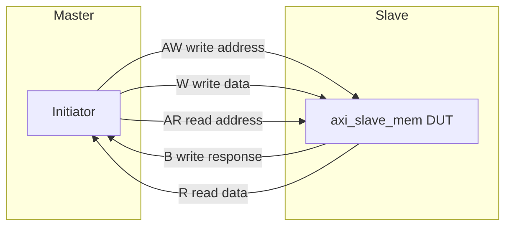

# ARM AXI — Official Documentation & Concept Guide

Use these **Arm** sources as the authoritative definition of protocol behavior. This repo implements **AXI4 full** (not AXI4-Lite); when in doubt, trust the spec over comments in RTL/TB.

## Official Arm documentation (primary)

| Document | ID | What it covers | Link |
|----------|-----|----------------|------|
| **AMBA AXI and ACE Protocol Specification** | **IHI 0022** | Current umbrella spec: AXI3, **AXI4**, AXI5, ACE, channels, bursts, ordering | [developer.arm.com/documentation/ihi0022/latest](https://developer.arm.com/documentation/ihi0022/latest) |
| **AMBA AXI4 Protocol Specification** | **IHI 0051** | AXI4-focused (widely used in industry); good for channel/burst basics | [developer.arm.com/documentation/ihi0051/latest](https://developer.arm.com/documentation/ihi0051/latest) |
| **AMBA** (architecture overview) | — | AMBA family, where AXI fits (AXI, ACE, CHI, etc.) | [developer.arm.com/architectures/system-architectures/amba](https://developer.arm.com/architectures/system-architectures/amba) |

> **Note:** IHI 0022 is the maintained “single spec” for AXI/ACE. IHI 0051 remains a common reference for **AXI4-only** projects. Both are free to download from Arm after sign-in.

### Related Arm specs (optional reading)

| Document | ID | When to read |
|----------|-----|--------------|
| AMBA AXI3 Protocol Specification | IHI 0022 (legacy sections) / older IHI 0024 | Legacy IP, AXI3 `WLAST`/`RLAST` differences |
| AMBA AXI5 / ACE5 | IHI 0022 / IHI 0068 | Cache coherency, atomic ops, not used in this repo |
| AMBA AXI4-Lite | IHI 0022 / IHI 0051 (Lite chapter) | Single-beat, no burst/ID — **not** our DUT |

---

## AXI4 in one page (concepts)

AXI splits a transaction into **five independent channels**. Each channel uses **`VALID` / `READY`** handshaking (transfer occurs when both are high on a clock edge).



| Channel | Direction (master → slave) | Role |
|---------|----------------------------|------|
| **AW** | Master → Slave | Start of write: address, burst length, size, burst type, ID |
| **W** | Master → Slave | Write data beats; **`WLAST`** on final beat of burst |
| **B** | Slave → Master | Write completion: **`BRESP`**, ID |
| **AR** | Master → Slave | Start of read: address, burst attributes, ID |
| **R** | Slave → Master | Read data beats; **`RLAST`** on final beat; **`RRESP`** per beat |

**Write flow (spec):** AW (and W can overlap) → all W beats → B response.  
**Read flow:** AR → one or more R beats → done when **`RLAST`** and **`RVALID`**.

---

## Signals used in this project

Parameters in `rtl/axi_slave_mem.sv` and `tb/tb_cocotb.sv`:

| Parameter | Value | Spec meaning (IHI 0022 / 0051) |
|-----------|-------|--------------------------------|
| `ADDR_WIDTH` | 32 | Byte address on AW/AR |
| `DATA_WIDTH` | 32 | `WDATA` / `RDATA` width |
| `ID_WIDTH` | 4 | `AWID`, `WID` (via B), `ARID`, `RID` — ordering per ID |
| `awlen` / `arlen` | 0–255 | **Burst length** = number of data transfers **minus 1** |
| `awsize` / `arsize` | 2 (log₂ bytes) | **Burst size** = bytes per beat (here 4 bytes = 32-bit) |
| `awburst` / `arburst` | `INCR` (2'b01) | Address increments between beats (see spec § burst types) |

### Burst types (Arm encoding)

| `AxBURST` | Name | Typical use |
|-----------|------|-------------|
| `2'b00` | FIXED | Same address every beat (FIFO/stream) |
| `2'b01` | INCR | Address += transfer size (memory, **used in our tests**) |
| `2'b10` | WRAP | Wrapping burst (cache lines); DUT supports, lightly tested |
| `2'b11` | Reserved | Must not be issued |

### Responses (`BRESP` / `RRESP`)

| Value | Name | Meaning |
|-------|------|---------|
| `2'b00` | OKAY | Success |
| `2'b01` | EXOKAY | Exclusive OK (not used here) |
| `2'b10` | SLVERR | Slave error |
| `2'b11` | DECERR | Decode error |

Our DUT returns **OKAY** on successful memory accesses.

---

## Spec chapters ↔ this repository

| Topic | Arm spec (IHI 0022 / 0051) | Where in repo |
|-------|----------------------------|---------------|
| Handshake (`VALID` until `READY`) | Global AXI handshake rules | `tb/assertions/axi_protocol_assertions.sv`, `formal/axi_handshake.sby` |
| Write burst & `WLAST` | Write data channel | `rtl/axi_slave_mem.sv`, cocotb `test_burst.py` |
| Read burst & `RLAST` | Read data channel | DUT read FSM, UVM monitor |
| `AxLEN` encoding | Address channel | Sequences / `cocotbext-axi` (auto burst split) |
| Ordering (same ID) | Transaction IDs | `ID_WIDTH` on AW/AR; formal assumes legal master |
| Stability of payload when `VALID` and not `READY` | Channel stability | SVA + `formal/axi_master_assumes.sv` |

---

## Recommended reading order

1. **IHI 0051** — Introduction + channel overview (short path to AXI4).
2. **IHI 0022** — Same topics with AXI5/ACE context; use as definitive reference.
3. Skim **burst types** and **response codes** (tables above).
4. Read handshake rules, then trace one write and one read in GTKWave:
   ```bash
   cd sim
   make cocotb-waves MODULE=test_smoke
   gtkwave sim_build/dump.fst waves.gtkw
   ```

---

## Third-party helpers (not Arm, but useful)

| Resource | Purpose |
|----------|---------|
| [cocotbext-axi](https://github.com/alexforencich/cocotbext-axi) | Python AXI master/slave BFM (used in `cocotb/`) |
| [AMBA AXI4 VIP / protocol checker IP](https://www.arm.com/products/silicon-ip/amba) | Commercial verification IP (optional; not in repo) |

---

## License

Arm specification PDFs are © Arm Limited. Download and use are subject to [Arm’s website terms](https://developer.arm.com/terms). This markdown file only **links** to Arm documentation; it does not redistribute the specs.
