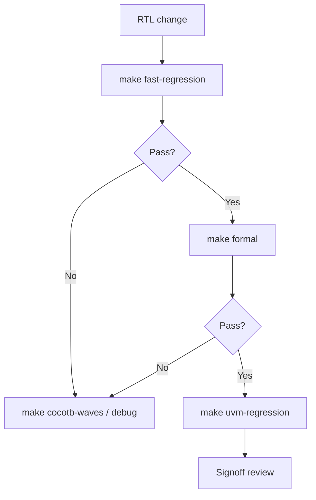

# DV Flow — Tool Selection

**Arm AXI documentation:** [arm_axi_references.md](arm_axi_references.md)

| Task | Tool | Command | When to use |
|------|------|---------|-------------|
| **Fast regression** | Verilator + cocotb + cocotbext-axi | `cd sim && make fast-regression` | Daily CI, quick RTL/TB sanity |
| **Protocol debug** | cocotb + GTKWave | `cd sim && make cocotb-waves` | Waveforms, stimulus tuning, bug hunt |
| **Formal checks** | SymbiYosys | `cd formal && make` | Handshake / safety proofs without sim vectors |
| **UVM regression** | Questa / VCS | `cd sim && make uvm-regression` | Coverage, UVM scoreboard, signoff |

## Fast regression (Verilator)

- **Simulator:** Verilator (C++ compile, very fast)
- **TB:** Python cocotb + `cocotbext-axi` `AxiMaster`
- **Tests:** `cocotb/test_smoke.py`, `test_burst.py`, `test_random.py`

```bash
cd sim
pip install -r ../requirements.txt
make fast-regression
# or
./run_cocotb.ps1 -Regression
```

## Protocol debug (cocotb + GTKWave)

```bash
cd sim
make cocotb-waves MODULE=test_smoke
gtkwave sim_build/dump.fst waves.gtkw
```

Edit sequences in `cocotb/*.py` and re-run — no UVM recompile.

## Formal checks (SymbiYosys)

| Task file | Proves |
|-----------|--------|
| `formal/axi_handshake.sby` | AXI stability SVA under legal master assumptions |
| `formal/axi_slave.sby` | DUT + protocol + slave OKAY responses (BMC depth 40) |

Requires [OSS CAD Suite](https://github.com/YosysHQ/oss-cad-suite/releases) (`sby`, `yosys` on PATH).

```bash
cd formal
make                    # all
make handshake          # handshake only
./run_formal.ps1 slave
```

## UVM regression (Questa / VCS)

Full ASIC-style flow: agents, scoreboard, functional coverage, SVA in sim.

```bash
cd sim
make compile
make uvm-run TEST=axi_smoke_test
make uvm-regression
```

Set `QUESTA_HOME` or use vendor `vlog`/`vsim` on PATH.

## Recommended workflow



1. **Every commit:** Verilator cocotb regression (~seconds).
2. **Debug:** cocotb + GTKWave on failing scenario.
3. **Before merge:** SymbiYosys formal (`formal/`).
4. **Release / signoff:** UVM regression + coverage on Questa/VCS.

## Dependencies

| Flow | Install |
|------|---------|
| Verilator | `winget install verilator` or OSS CAD Suite |
| cocotb | `pip install -r requirements.txt` |
| GTKWave | `choco install gtkwave` |
| SymbiYosys | OSS CAD Suite (`sby`) |
| UVM | Questa / VCS / Xcelium |
